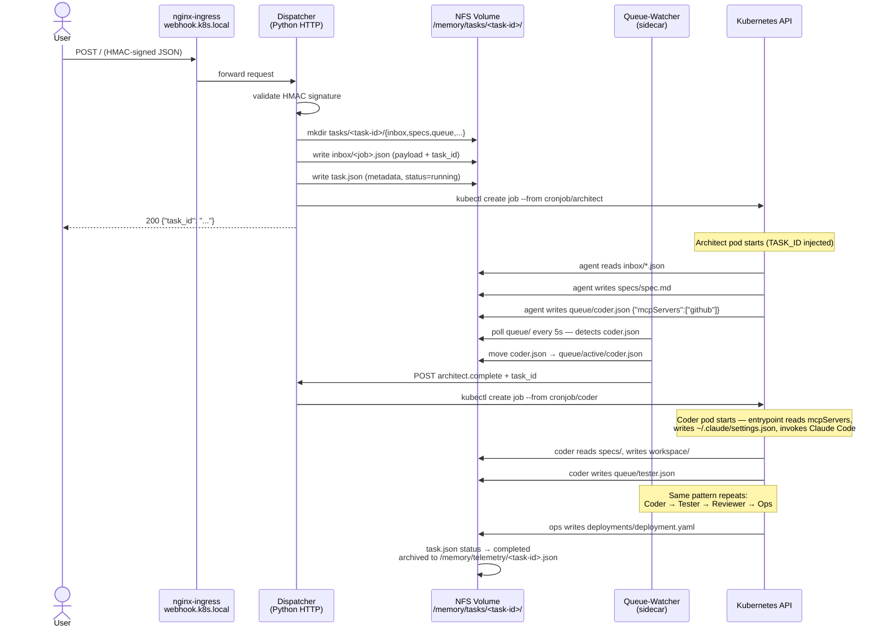

# Agent Task Flow

How a task moves through the AgentForge pipeline from webhook to completed deployment.



## Queue File Contract

Each agent writes a JSON trigger file to `<task-memory-base>/queue/<next-role>.json`
to hand off to the next stage. The `mcpServers` field is optional — only include
servers the next agent actually needs.

```json
{
  "from": "architect",
  "task": "brief description of what was done",
  "output": "/memory/tasks/<task-id>/specs/spec.md",
  "notes": "anything the next agent needs to know",
  "mcpServers": ["github"]
}
```

The queue-watcher moves the file to `queue/active/` before dispatching, preventing
double-fire if the watcher polls again before the job starts.
