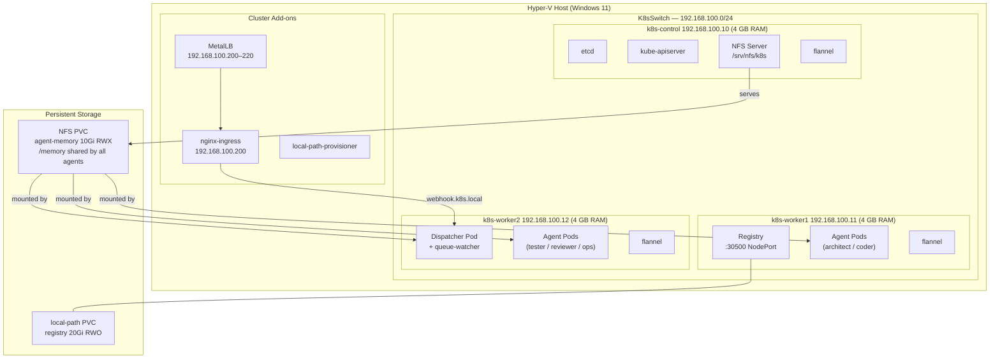

# Kubernetes Environment

**AgentForge** runs on a three-node Hyper-V cluster. The control plane hosts the
NFS server; both workers carry agent workloads.

## Node Roles

| Node | IP | Key Workloads |
|------|----|---------------|
| k8s-control | 192.168.100.10 | Control plane, NFS server |
| k8s-worker1 | 192.168.100.11 | Local registry (NodePort :30500), agent pods |
| k8s-worker2 | 192.168.100.12 | Dispatcher + queue-watcher, agent pods |

- **CNI:** Flannel `10.244.0.0/16`
- **Storage classes:** `nfs` (RWX for agent memory), `local-path` (RWO for registry)
- **Load balancer:** MetalLB pool `192.168.100.200–220`
- **Ingress:** nginx at `192.168.100.200` → `webhook.k8s.local`
