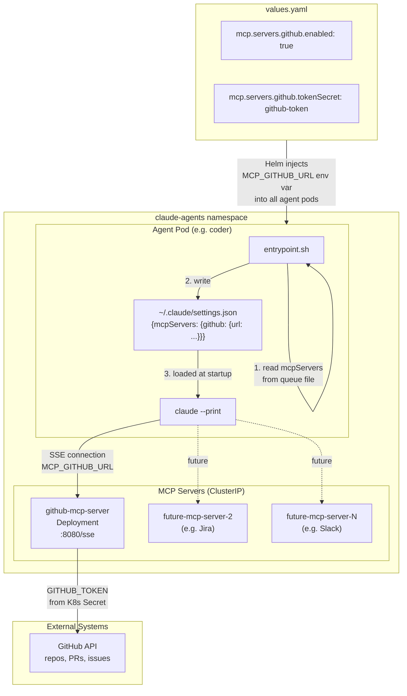
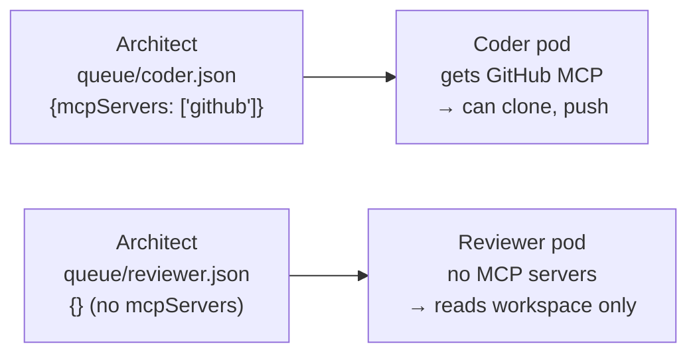

# MCP Server Pattern

AgentForge uses in-cluster MCP (Model Context Protocol) servers as its extensibility
mechanism. New external system integrations are added by deploying a new MCP server —
no agent image rebuild required. See ADR-011.

## How the Architect Controls Access

The architect writes queue files for downstream agents. Including `mcpServers` in
a queue file grants that agent access to the listed servers at runtime.

## Adding a New MCP Server

1. Add a new block under `mcp.servers` in `values.yaml` with image, port, tokenSecret
2. Add a new `templates/mcp/<name>-mcp-server.yaml` (Deployment + ClusterIP Service)
3. Add a new `url_map` entry in `entrypoint.sh` for the server name
4. Add a new `MCP_<NAME>_URL` env var injection in `_helpers.tpl` `claude-agents.mcpEnv`
5. Document the server in the Available servers table in `agent-base.md`
6. `helm upgrade` — no image rebuild needed

## Deployed MCP Servers

| Name | Image | Status | Provides |
|------|-------|--------|----------|
| `github` | `ghcr.io/github/github-mcp-server` | Implemented (disabled until token secret created) | Repo clone/push, PR create, issue read |
