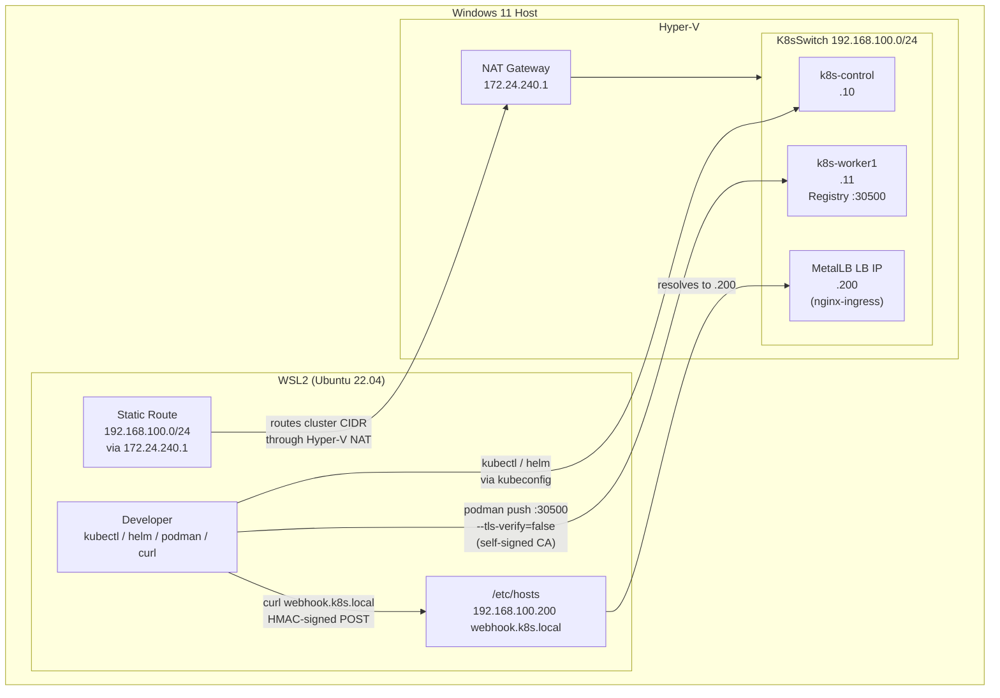

# WSL ↔ Kubernetes Connectivity

How the WSL2 development environment connects to the Hyper-V cluster for image
pushes, kubectl commands, and webhook testing.



## Route Persistence

The static route drops on WSL restart and must be re-added:

```bash
sudo ip route add 192.168.100.0/24 via 172.24.240.1
```

A Windows scheduled task exists to restore this automatically but has not been
fully validated (see tasks.md backlog).

## Registry TLS

The local registry at `192.168.100.11:30500` serves HTTPS with a self-signed cert.

- **Push from WSL:** `podman push ... --tls-verify=false` (bypasses cert check on push)
- **Pull from nodes:** nodes trust the CA via system trust store
  (`/usr/local/share/ca-certificates/lab-registry-ca.crt`)
- **TLS key material:** `/tmp/registry-tls/` on WSL — not committed; regenerate if lost

## Hosts File (WSL + Windows)

Both WSL `/etc/hosts` and Windows `C:\Windows\System32\drivers\etc\hosts` need:

```
192.168.100.200 webhook.k8s.local
```

This maps the MetalLB IP to the ingress hostname used by the webhook dispatcher.
